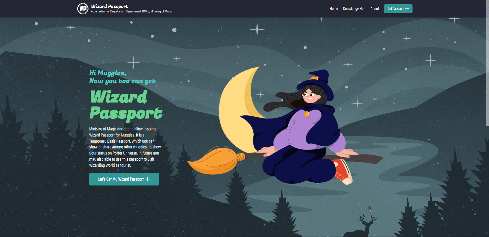

# Wizard Passport

Wizard Passport is a Web App created around Harry Potter, Wizard Universe. It allows users to share your love for Harry Potter in a fun way with friends. You can choose things like Hogwarts House, Wand Type, Pertonus Type, Etc... and generate a custom "Wizard Passport" based on them. Then the generated "Wizard Passport" can be Shared, Downloaded, Viewed in multiple ways. Such as Direct Link, IFrame, Markdown, SVG, JPG, PNG, Facebook, Twitter, Etc...

Below is a live example of "Wizard Passport", embed in Markdown.

	

This full-stack project is mainly powered by **TypeScript, React & Serverless Functions**.

See Live Demo at [WizardPassport.com](https://wizardpassport.vercel.app/)

 

---

## **Used Technologies**

Main technologies and tools used for this project.

| FrontEnd        | BackEnd                           | Tools                         | DevOps + Other    |
| --------------- | --------------------------------- | ----------------------------- | ----------------- |
| Type Script     | Serverless Functions (NodeJS)     | ESLint + Prettier + StyleLint | Vercel            |
| React           | React Server Side Rendering (SSR) | Husky + LintStaged            | Google Analytics  |
| React Location  |                                   | PreCommit Hooks               | SVG Manipulation  |
| React Hook Form |                                   | Babel                         | Image Conversion  |
| React Query     |                                   |                               | Offline Detection |
| Zustand         |                                   |                               | Encoding          |
| Immer           |                                   |                               |                   |
| Yup             |                                   |                               |                   |
| HTML2Canvas     |                                   |                               |                   |
| SimpleScrollBar |                                   |                               |                   |
| LogLevel        |                                   |                               |                   |
| ReactHotToast   |                                   |                               |                   |
| Chakra UI       |                                   |                               |                   |

 
 

---

## **How To Run**

- First of all, Create `.env` file with relevant fields and values. Check `.env.example` for necessary fields.
- Make sure NodeJS are installed on system.
- Then run `npm install` to install all dependencies.
- Then run `npm start` to start normal server. (Run `npm run vercel-dev-server` if want to run serverless functions locally as well.)
- Now you can interact with program through http://localhost:3000.

 

---

## **How To Lint/Code Quality**

- Linting Only : Run `npm run lint-all`. (This runs Prettier, ESLint, StyleLint)
- Type Script : Run `npm run manual-tscheck`
- Full Code Quality Check : Run `full-code-quality-check`

---
